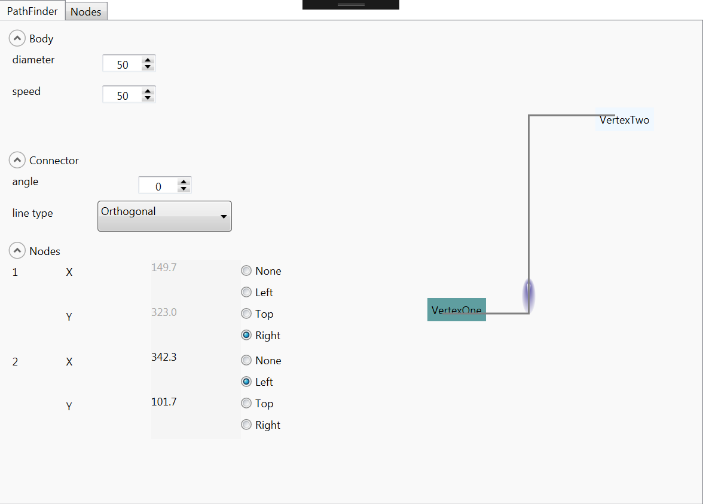
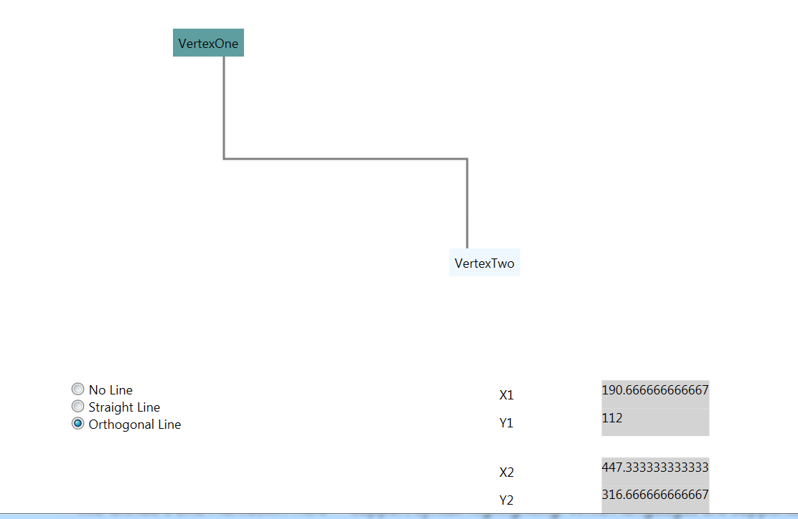

# PathFinder

## lastest 
wpf demo/control libraries:
Control libraries have controls for visually connecting two points.
Demo demonstrates different line-types (curve/orthoganal/straight), animation options, etc. possible
Animations based on work within https://github.com/ptddqr/wpf-echarts-map

## modified

## original
Wpf project that displays two nodes and the path that connects them via
an orthogonal line (i.e one that is composed of at least two segments at a right angle).

The orthogonal line is calculated using vector maths whose explanation is included in the code.

The MVVM approach is lightely used.

This could be utlised in a flowchart-diagram based project.

Issues include:

~~fixing the position of the connection tips to the node's center or a position on the node's boundary relative to it.~~ (23/01/2022)

limiting the movement of nodes to the dimensions of the canvas.
