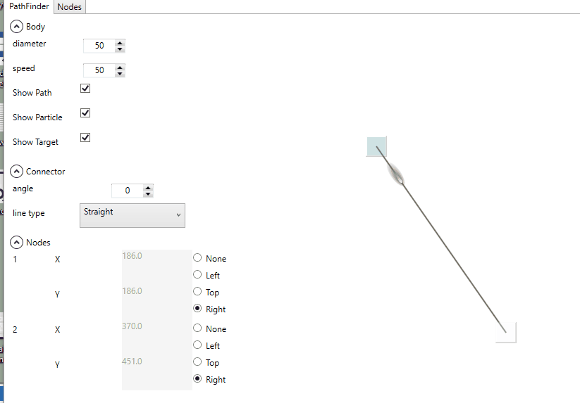

## Introduction

wpf demo/control libraries:

- Controls for visually connecting two points on a Canvas.
- different line-types (curve/orthoganal/straight), animation-options, node-positions etc. possible.

### Lastest 

### Modified

### Original

## Issues:

- [x] fixing the position of the connection tips to the node's center or a position on the node's boundary relative to it.(23/01/2022)
- [ ] limiting the movement of nodes to the dimensions of the canvas.

## Credit
- [animations](https://github.com/ptddqr/wpf-echarts-map) 
- [gifs](https://github.com/NickeManarin/ScreenToGif/)
